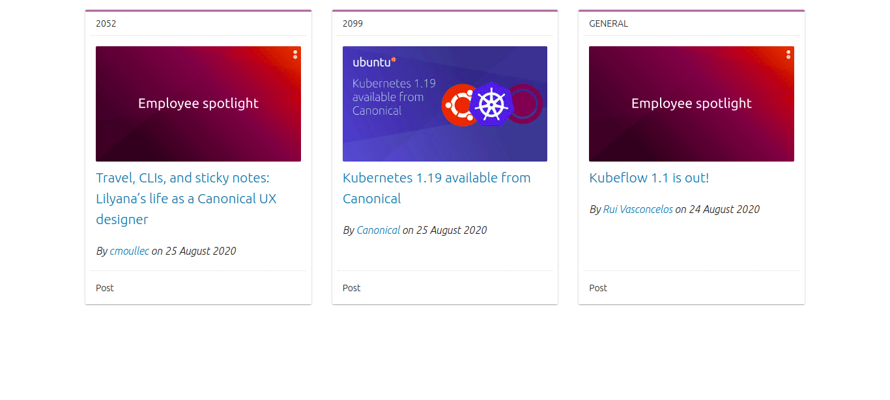

# Blog Posts

> This small project displays some **blog posts** obtained from a WordPress **API**. It is built using **ViteJS** with **Vanilla JavaScript** and **TypeScript** and utilizes the **Vanilla Framework**.

## How to Run Locally

- Clone the repository.
- Run `yarn install` or `npm install` to get the dependencies.
- Run `yarn run dev` or `npm run dev` to start the project locally.

## Project Outcome

